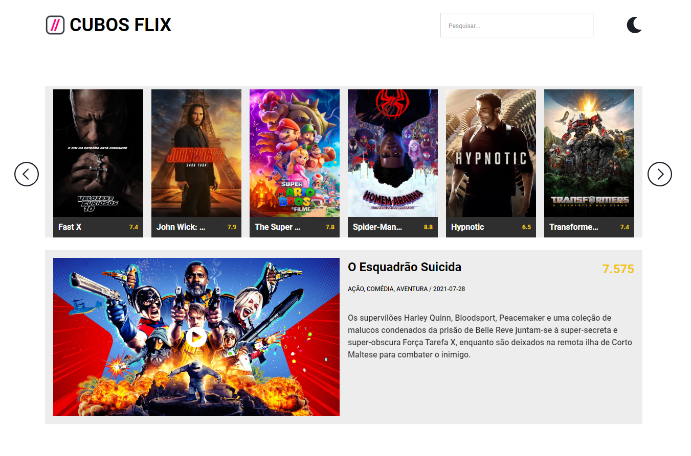

# Cubos Flix
Este projeto foi parte do desafio que eu realizei para a conclusão do Módulo 3 na Cubos Academy.
O objetivo foi criar uma aplicação para um serviço de streaming, onde os usuários podem pesquisar os filmes disponíveis.
  
Os dados do website foram requisitados da seguinte API: https://developer.themoviedb.org/docs
  

